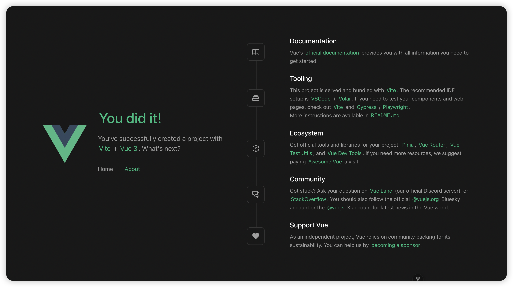
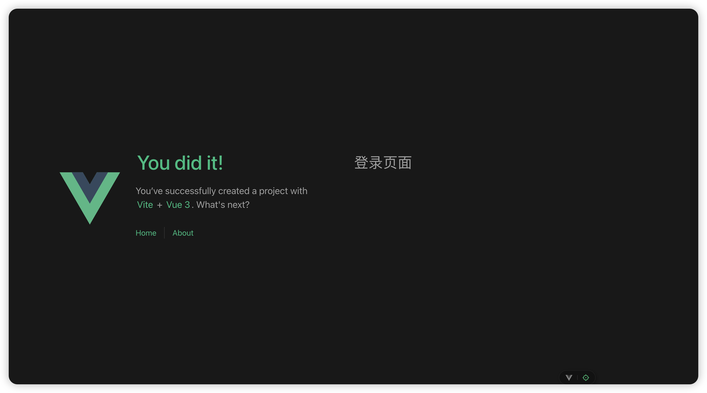
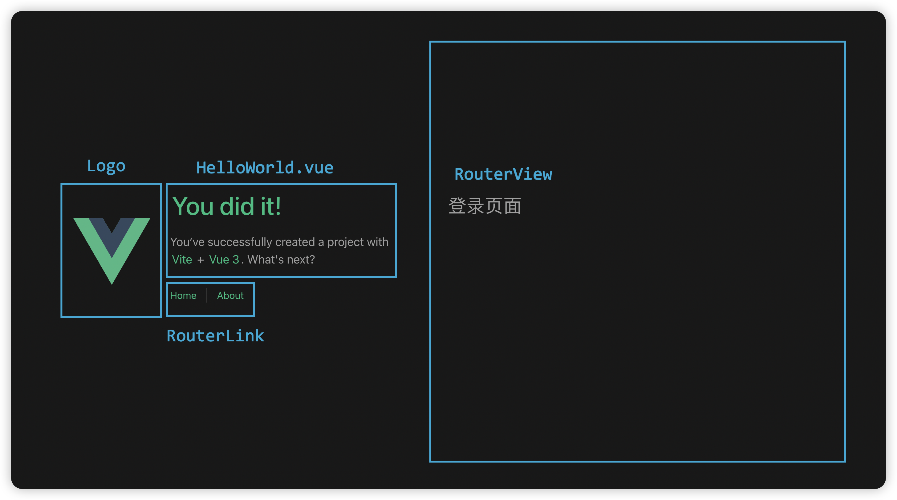
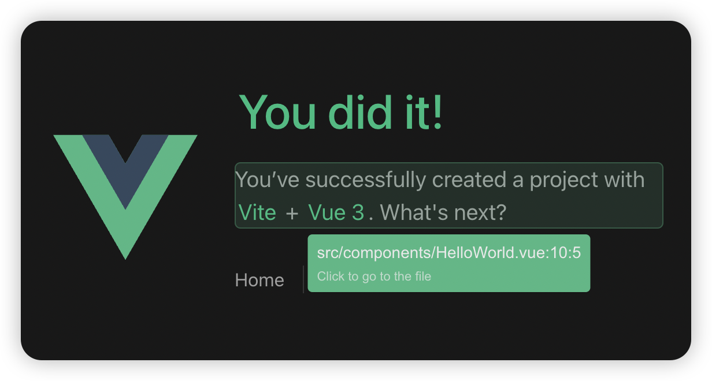

# 02 - 页面构成
*本文将简要介绍 Vue 组件代码和渲染出的页面是如何对应的。*
- *需要你有基本的编码经验 (如 C 和 Java), 以及对 HTML 和 CSS 的基本了解。有关具体的编写方法, 我们将在实践中学习。*

## 一. 准备步骤
### 1. 文件创建
- 在 `./src` 目录下创建 `views` 文件夹, 用于存放视图组件。
- 在 `views` 文件夹下创建 `user` 文件夹, 用于存放用户相关的视图组件。
- 在 `user` 文件夹下创建 `Login.vue` 和 `Register.vue` 文件, 分别用于实现登录和注册页面。
- 在 `Login.vue` 和 `Register.vue` 文件中, 添加以下代码:
  ```html
  <script setup lang="ts">

  </script>

  <template>
    <div>
      <h1>登录页面</h1> <!-- 若为注册页面, 此处填写"注册页面" -->
    </div>
  </template>

  <style scoped>

  </style>
  ```
此处简要介绍上述代码中出现的三个标签: `script`, `template` 和 `style`, 分别用于编写脚本、模板和样式。
- `script`: 分为选项式和标签式两种编写方法。*变量声明、函数方法、页面逻辑将在 `script` 中实现。*
  - `setup`代表其使用了组合式 API。*如果在查找资料时, 发现 `<script>` 的代码语法和我们介绍的不一致, 则是使用了不同风格的 API。本质上, 两种风格的 API 是互通的。*
关于 API 风格, 请参阅[官方文档](https://cn.vuejs.org/guide/introduction.html#api-styles)。
  - `lang="ts"`代表其使用 TypeScript 语言编写, 具有更强的类型约束。
- `template`: 使用 HTML 语言, 用于编写 HTML 模板。*页面布局将在 `template` 中实现。*
- `style`: 使用 CSS 语言, 用于编写 CSS 样式。*页面样式将在 `style` 中实现。*


此时终端运行`npm run dev`, 启动我们的项目, 访问 [http://localhost:5173/](http://localhost:5173/) , 可以看到首页是 Vue3 官方的欢迎页面。

那么, 要如何进行配置, 才能访问到我们刚刚创建的登录页面呢?

### 2. 路由配置
修改 `./src/router/index.ts` 文件, 配置路由。

```ts
// index.ts
// 修改 createRouter 函数参数中的 routes 参数
// ... 其它代码
  routes: [
    {
      path: '/',
      name: 'home',
      component: HomeView,
    },
    {
      path: '/about',
      name: 'about',
      component: () => import('../views/AboutView.vue'),
    },
    {
      path: '/login',
      name: 'login',
      component: () => import('../views/user/Login.vue'),
    },
    {
      path: '/register',
      name: 'register',
      component: () => import('../views/user/Register.vue'),
    },
  ],
//... 其它代码
```

此时浏览器访问 [http://localhost:5173/login](http://localhost:5173/login) 和 [http://localhost:5173/register](http://localhost:5173/register) , 可以看到我们自己的登录页面和注册页面, 说明路由配置成功生效了。



## 二. 代码分析
### App.vue
为什么我们编写的页面代码只替换了框架的右侧区域, 而其他的部分依然保持了原样呢?
在 [01-项目结构]() 中, 我们简要介绍了 Vue 的文件结构。其中 `./src` 目录下的 `App.vue` 文件是 Vue 的**根组件**, 包含了整体布局和路由出口。

```html
<!-- App.vue -->
<script setup lang="ts">
import { RouterLink, RouterView } from 'vue-router'
import HelloWorld from './components/HelloWorld.vue'
</script>

<template>
  <header>
    

    <div class="wrapper">
      <HelloWorld msg="You did it!" />

      <nav>
        <RouterLink to="/">Home</RouterLink>
        <RouterLink to="/about">About</RouterLink>
      </nav>
    </div>
  </header>

  <RouterView />
</template>

<style scoped>
  /* ... 样式代码 */
</style>
```

我们来分析一下 `App.vue` 的代码:
- `<script>`: 此处引用了外部组件。
  ```html
  <script setup lang="ts">
  import { RouterLink, RouterView } from 'vue-router'
  import HelloWorld from './components/HelloWorld.vue'
  </script>
  ```
  - `RouterLink` 和 `RouterView` 是 Vue Router 提供的组件, 用于实现路由跳转和路由出口。*即, 用来实现页面跳转。*
  - `HelloWorld.vue` 是框架代码提供的 Vue 组件, 当然, 也可以替换成我们自己编写的组件。此处简要注释它的内容:
    ```html
    <!-- ./components/HelloWorld.vue -->
    <script setup lang="ts">
    defineProps<{ 
      // 用于父组件向子组件的数据传递。
      // 例如, 父组件中使用 <HelloWorld msg="You did it!" /> 调用子组件时, 
      // 下面的 `msg` 将被赋值为 "You did it!"。
      msg: string
    }>()
    </script>

    <template>
      <!-- 一段文本的 html 代码。此处不作过多解释 -->
      <div class="greetings">
        <h1 class="green">{{ msg }}</h1>  <!-- 此处的 `msg` 是父组件传递过来的 -->
        <h3>
          You’ve successfully created a project with
          <a href="https://vite.dev/" target="_blank" rel="noopener">Vite</a> +
          <a href="https://vuejs.org/" target="_blank" rel="noopener">Vue 3</a>. What's next?
        </h3>
      </div>
    </template>

    <style scoped>
      /* ... 样式代码 */
    </style>
    ```

- `<template>`: 用于编写页面布局的 HTML 代码。
  我们在 `<script>` 中引用的 `RouterLink`、 `RouterView` 和 `HelloWorld` 组件, 都可以在 `<template>` 中直接使用, 相当于把子组件对应的代码填入父组件调用子组件的位置。
  ```html
  <!-- App.vue -->
  <template>
    <header>
      <!-- Logo 图标 -->
      

      <div class="wrapper">
        <!-- 调用 HelloWorld 子组件, 其中传递给子组件的 `msg` 为 "You did it!" -->
        <HelloWorld msg="You did it!" />

        <nav>
          <!-- 调用路由跳转的 RouterLink 子组件, 点击后自动跳转到 `to` 所指定的路由地址 -->
          <RouterLink to="/">Home</RouterLink>
          <RouterLink to="/about">About</RouterLink>
        </nav>
      </div>
    </header>

    <!-- 调用路由跳转的 RouterView 子组件, 展示路由路径对应的组件 -->
    <RouterView />
  </template>
  ```

## 三. 页面构成
了解了上述内容之后, 页面的各部分组成就很明确了:


可以看到, 路由跳转时, 页面的右侧部分被替换为了路由路径对应的页面组件(例如, `/` 对应的 `HomeView`, `/about` 对应的 `../views/AboutView.vue`)。**这就是 `RouterView` 组件的作用。**

**因此, 如果你希望修改代码的页面模板布局, 请修改 `App.vue` 文件。**

官方的示例代码为我们提供了一个很好的例子。
实际开发中, 尤其是多人合作的项目, 很容易将页面各个部分拆分出各个子组件。 编码工作将在不同的 `.vue` 文件中进行, 代码更加简洁, 降低耦合度, 减少工作冲突, 提高可维护性。

## Tips: 开发工具
我们可以使用官方提供的工具 ( Vue DevTools, 一般位于页面最下方按钮), 快速定位到页面的各个组件对应的文件及代码位置。
下图使用了 Toggle Component Inspector, 将鼠标指针移至对应区域:
