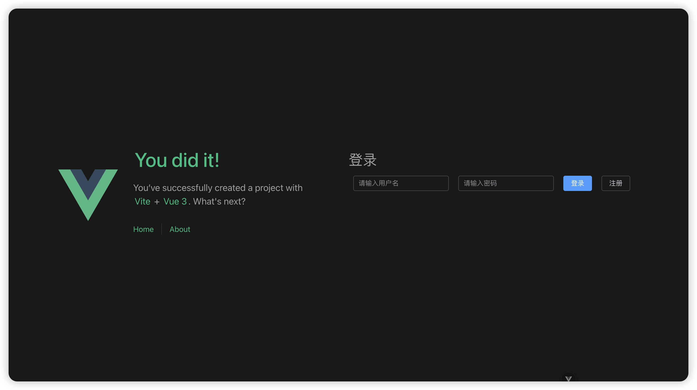
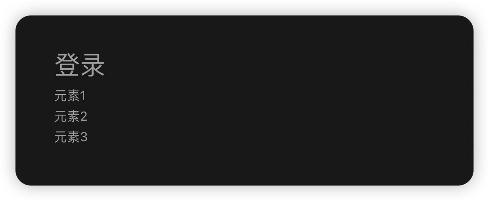
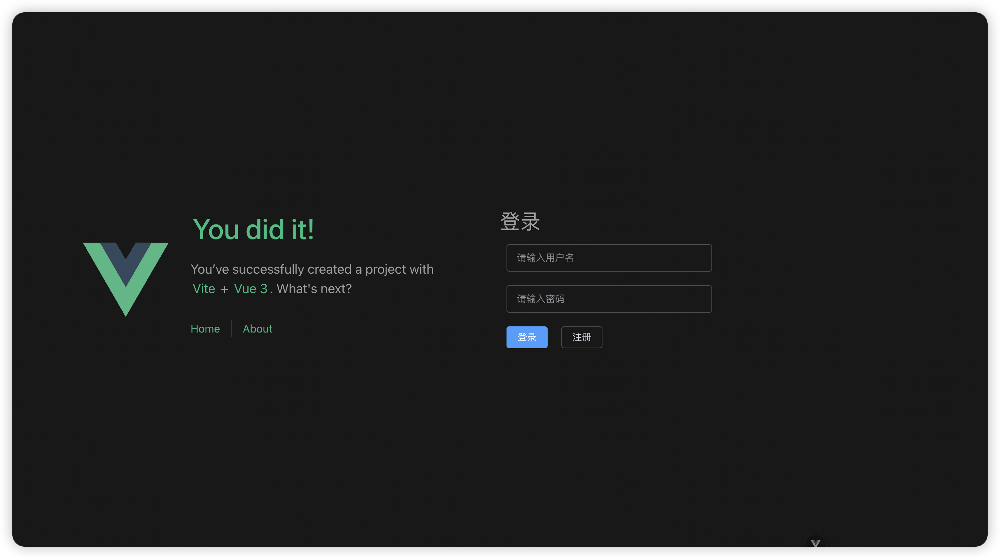
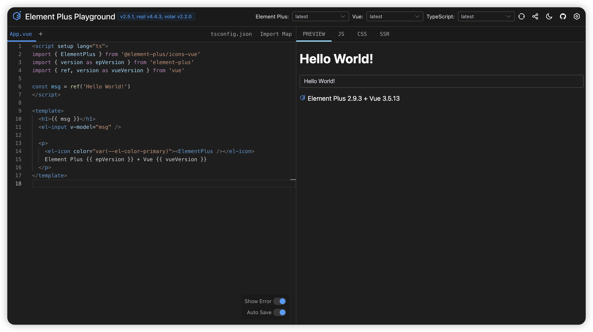

# 05 - Style 优化
*更多有关页面布局的内容, 请自行学习 HTML 与 CSS 相关知识。*

打开我们先前编写的登录页面, 可以看到类似下图的画面:

我们可能会觉得: 元素过于紧凑, 布局不够合理, 不够美观。

接下来介绍如何编写 style 代码, 优化组件样式。

*了解过 CSS 的同学会知道, CSS 有内联样式、内部样式表和外部样式表的形式。此处我们简要介绍内联样式。*

## 修改 template 模板
打开 `Login.vue` 文件, 修改 `<template>` 中的内容, 添加 `style` 样式:
```html
<!--Login.vue-->
<template>
  <div>
    <h1>登录</h1>
    <el-input v-model="username" placeholder="请输入用户名" clearable 
      style="margin: 10px; width: 300px"
    />
    <el-input v-model="password" placeholder="请输入密码" clearable show-password 
      style="margin: 10px; width: 300px"
    />
    <el-button @click="clickButtonLogin" type="primary" style="margin: 10px;">登录</el-button>
    <el-button @click="clickButtonRegister" style="margin: 10px;">注册</el-button>
  </div>
</template>
```
- `margin`: 指定了元素的外边距。
- `width`: 指定了元素的宽度。

修改完毕后, 我们发现界面如下图所示:

可以看到, 元素都排列在同一行中了。

我们希望用户名和密码的输入框分别位于两行中、两个按钮在第三行。如何修改页面布局, 可以达到上述效果?

思路: 用容器包含纵向排列的三行容器, 每行中包含我们需要的组件。
听起来有些抽象, 我们来实践一下。

在 `<template>` 中编写以下代码:
```html
<template>
  <div>
    <h1>登录</h1>
    <div style="display: flex; flex-direction: column;">
      <div>元素1</div>
      <div>元素2</div>
      <div>元素3</div>
    </div>
  </div>
</template>
```
- `display: flex`: 使用 `flex` 弹性布局。
- `flex-direction: column`: 容器内元素排列方向为纵向排列。

返回页面查看效果:

说明我们的容器布局符合我们的预期, 只需要修改子容器 `<div>` 中的内容即可:
```html
<!-- Login.vue -->
<template>
  <div>
    <h1>登录</h1>

    <!-- 父容器: 内部元素纵向排列 -->
    <div style="display: flex; flex-direction: column;">
      <!-- 第一行: 用户名输入框 -->
      <div>
        <el-input v-model="username" placeholder="请输入用户名" clearable 
          style="margin: 10px; width: 300px"
          size="large"
        />
      </div>
      <!-- 第二行: 密码输入框 -->
      <div>
        <el-input v-model="password" placeholder="请输入密码" clearable show-password 
          style="margin: 10px; width: 300px"
          size="large"
        />
      </div>
      <!-- 第三行: 按钮 -->
      <div>
        <el-button @click="clickButtonLogin" type="primary" style="margin: 10px;">登录</el-button>
        <el-button @click="clickButtonRegister" style="margin: 10px;">注册</el-button>
      </div>
    </div>
  </div>
</template>
```

返回页面, 查看修改后的效果:

基本符合我们的预期需求。

## Tips: Element Plus 组件样式
在 [Element Plus 官方组件文档](https://element-plus.org/zh-CN/component/overview.html) 中, 我们可以了解到 Element Plus 组件的特殊样式如何设置。
有时候, `style` 中的某些样式与这些组件样式并不兼容, 修改后可能导致一些不符合预期的效果。

Element Plus 也提供了一个很有趣的 [PlayGround](https://element-plus.run/), 可以在使用 Element Plus 组件编辑代码时, 实时预览渲染效果。

