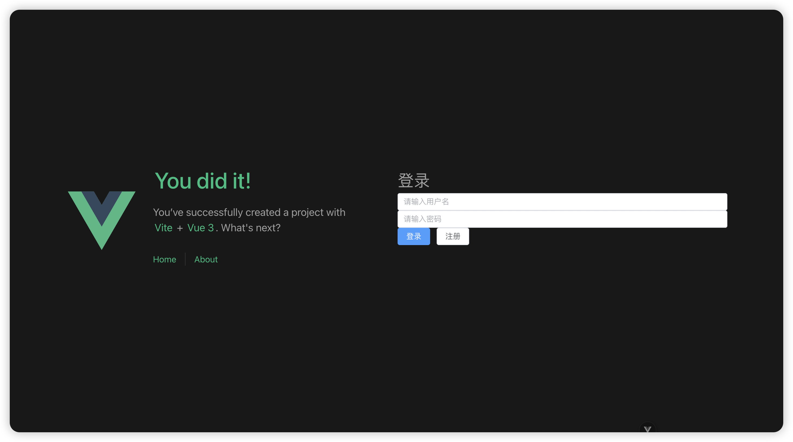
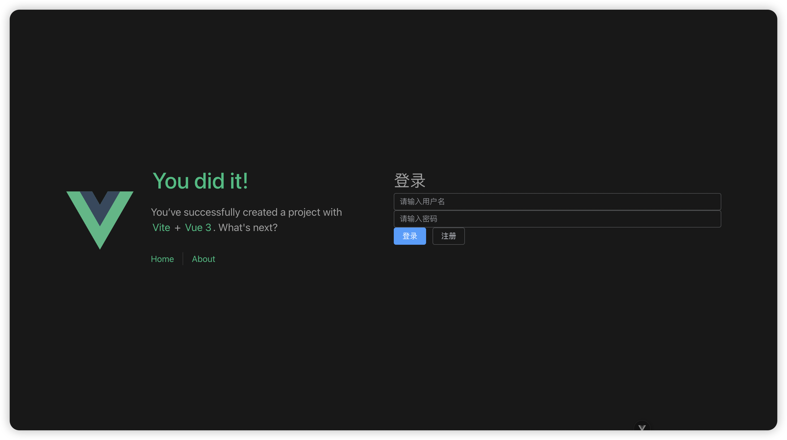

## 03 - 变量与函数
*变量的声明和函数方法的编写, 主要在 `<script>` 中进行。*

我们尝试完善先前创建的登录注册页面。
### 一. 变量声明
1. 修改先前创建的 `Login.vue` 文件, 在 `<script>` 的开头引入 `ref`:
```html
<!-- Login.vue --> 
<script>
import { ref } from 'vue'
// ...
</script>
```
2. 声明变量: "用户名" 和 "密码"。
```js
const username = ref('')
const password = ref('')
```
*在 JavaScript 中, 行尾的分号 (`;`) 是不必要的。*
*为避免在其他语言中混淆, 还是建议加上行尾的分号, 这是个好习惯。*

在 Vue3 中, 推荐你使用 `ref()` 来进行变量的声明。
`ref()` 的参数会决定变量值的类型, 例如:
- `ref('')` , 则该变量的值的类型为 `string`;
- `ref(0)` , 则该变量的值的类型为 `number`;
- `ref(false)` , 则该变量的值的类型为 `boolean`;
- 若参数缺省, 即 `ref()`, 则变量的值的类型为 `any`。

*建议在变量声明时进行初始化, 这样可以指定值的类型。当然, 不指定类型也不会导致报错。*

### 二. 变量调用
#### 1. 在 `<script>` 中使用变量
在 `<script>` 中调用 `ref` 创建的变量的值, 方法比较特殊, 需要使用变量的属性 `.value`。
在 `<script>` 部分编写以下代码:
```js
const num = ref(123);

// 输出控制台日志
console.log(num);
console.log(num.value);
```
保存后查看项目页面, 在浏览器中按下 `F12` 查看开发工具控制台, 得到的结果如下:
```js
RefImpl {dep: Dep, __v_isRef: true, __v_isShallow: false, _rawValue: 123, _value: 123}
123
```
点击展开第一行, 内容如下:
```js
{
  "dep": {
    "version": 0,
    "sc": 0
  },
  "__v_isRef": true,
  "__v_isShallow": false,
  "_rawValue": 123,
  "_value": 123
}
```
*在开发和调试过程中, 学会使用 `console.log()` 方法, 通常可以帮助你解决很多问题。*

由此可以看出, 通过 `ref()` 方式创建的变量, 实际上是 `Object` 类型。
如果想在 `<script>` 中调用它的值, 请使用 `num.value` 的形式。

#### 2. 在 `<temple>` 中使用变量
在 `<temple>` 中使用 `ref()` 创建的变量就没那么复杂, 和在 HTML 中使用其他变量一样, 只需要使用变量名即可。

### 三. 编写页面模板
使用 HTML, 在 `template` 中编写页面模板。
先前我们已经在[环境配置]()中安装了 Element Plus 组件库, 利用这些组件, 可以让界面美化更加方便。

在 `<template>` 中编写以下代码:
```html
<template>
  <div>
    <h1>登录</h1>
    <el-input v-model="username" placeholder="请输入用户名" clearable />
    <el-input v-model="password" placeholder="请输入密码" clearable show-password/>
    <el-button type="primary">登录</el-button>
    <el-button>注册</el-button>
  </div>
</template>
```
- `<el-input>`: 
  - `v-model` 属性绑定了输入框所对应的变量值;
  - `placeholder` 指定了输入框为空时显示的文字内容;
  - `clearable` 表示输入框可以点击按钮快速清空。
  - `show-password` 表示输入框是一个密码框, 内容将被显示为星号掩码。
- `<el-button>`:
  - `type` 属性指定了按钮的类型。 不同类型的按钮有不同的颜色样式。

*更多有关 Element Plus 组件的介绍和使用方法, 请访问[官方文档](https://element-plus.org/zh-CN/component/overview.html), 可以方便地找到你想要的各种组件。*

打开浏览器访问登录页, 可以看到我们成功添加了组件。


如果你和博主一样使用系统深色模式, 且认为当前的组件样式在深色模式下不够美观, 可以参考官方的 [Element Plus 深色模式](https://element-plus.org/zh-CN/guide/dark-mode.html)文档, 将组件样式调整为深色。
1. 在 `index.html` 中, 添加 `<html class="dark">`
2. 在 `main.ts` 中, 导入 `import 'element-plus/theme-chalk/dark/css-vars.css'`



### 四. 事件绑定
我们希望点击 "登录" 按钮可以跳转登录, 点击 "注册" 可以跳转到注册页。那么, 如何为按钮绑定点击事件?
#### 1. 在 `<script>` 中编写方法
- 首先在 `<script>` 中引入路由跳转。
```js
import { router } from '@/router' // 替换成 router 目录的相对路径
```
- 编写点击按钮后调用的方法。
```js
// 点击登录按钮
function clickButtonLogin() {
  // 临时功能: 展示弹框。
  // 有关具体登录跳转功能的实现, 将在下一节中完善 api 的调用。
  alert("用户名: " + username.value + "\n密码: " + password.value);
  alert("登录成功!");
}

// 点击注册按钮
function clickButtonRegister() {
  // 路由跳转至注册页
  router.push("./register");
}
```
*团队合作项目中, 请注意变量名和方法名的命名规范, 以及编写代码注释。必要时, 可以拷打ChatGPT, 防止队友拷打你。*

#### 2. 在 `<template>` 中绑定事件
在 `<template>` 中, 绑定按钮的点击事件`@click`。
```html
<el-button @click="clickButtonLogin" type="primary">登录</el-button>
<el-button @click="clickButtonRegister">注册</el-button>
```
现在, 在你的页面中点击按钮, 可以看到事件方法成功调用了。